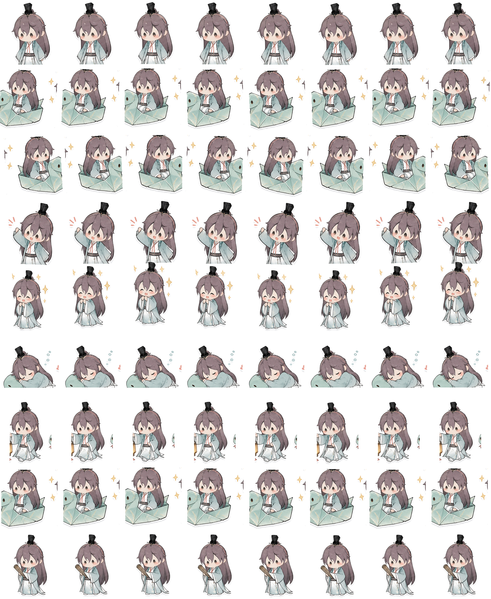

# 袁基 Codex Pet

袁基 (&#21021;&#35265;) is a custom Codex Desktop pet package with a gentle chibi xianxia style.

## Preview



## Install

Run this in Windows PowerShell from the repository root:

```powershell
powershell -ExecutionPolicy Bypass -File .\install.ps1
```

The installer copies the pet files to `%USERPROFILE%\.codex\pets\chujian` and sets:

```toml
selected-avatar-id = "custom:chujian"
```

If Codex does not switch immediately, restart Codex or choose Chujian from Settings -> Appearance -> Custom pets.

## Lively Animation Set

This version moves beyond simple whole-sticker offsets. Each Codex state has a more expressive but still quiet animation:

| Row | State | Motion design |
|---|---|---|
| 0 | `idle` | Breathing, blinking, subtle hair and sleeve motion |
| 1 | `running-right` | Paper snake glides right with sparkle trail |
| 2 | `running-left` | Paper snake glides left with sparkle trail |
| 3 | `waving` | Friendly waving with drifting petals |
| 4 | `jumping` | Takeoff, hang time, landing squash and rebound |
| 5 | `failed` | Sleepy blocked state with sigh bubbles |
| 6 | `waiting` | Lantern waiting pose with swinging glow |
| 7 | `running` | Focused working pose with moving thought sparkles |
| 8 | `review` | Result-ready pose with check card and nodding motion |

## Regenerate

The package includes a reproducible builder:

```powershell
& "$env:USERPROFILE\.cache\codex-runtimes\codex-primary-runtime\dependencies\python\python.exe" .\tools\build_spritesheet.py
```

The builder:

- Uses `source-assets/generated/base-spritesheet.webp` as the stable base frame source.
- Writes generated helper overlays into `source-assets/generated/`.
- Rebuilds `pet/spritesheet.webp`.
- Rebuilds `preview/spritesheet-preview.png`.
- Keeps `pet/pet.json` compatible with Codex.

## Manual Install

Create this directory:

```text
%USERPROFILE%\.codex\pets\chujian
```

Copy:

```text
pet/pet.json -> %USERPROFILE%\.codex\pets\chujian\pet.json
pet/spritesheet.webp -> %USERPROFILE%\.codex\pets\chujian\spritesheet.webp
```

Then set this under `[desktop]` in `%USERPROFILE%\.codex\config.toml`:

```toml
selected-avatar-id = "custom:chujian"
```

## Codex Format

- Sheet size: `1536 x 1872`
- Grid: `8 x 9`
- Frame size: `192 x 208`
- Supported image format: `webp` or `png`

## Files

```text
pet/
  pet.json
  spritesheet.webp
preview/
  spritesheet-preview.png
source-assets/
  pet-sheet.png
  generated/
tools/
  build_spritesheet.py
install.ps1
uninstall.ps1
```
